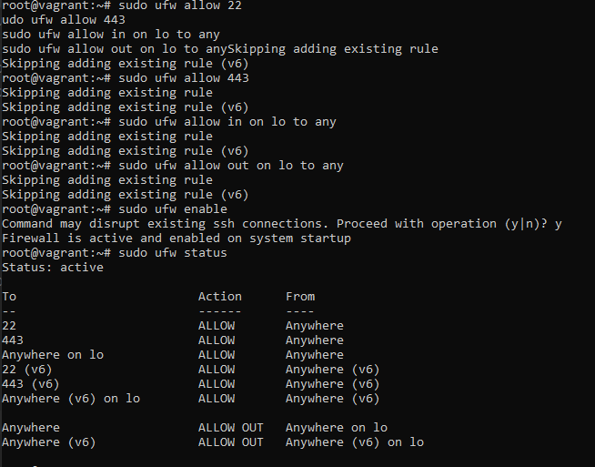
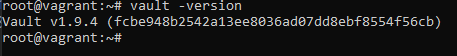
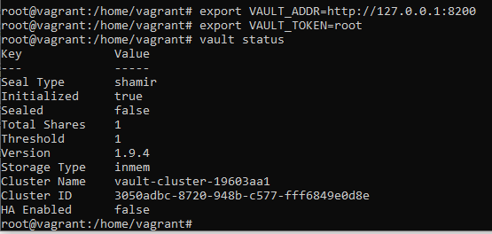
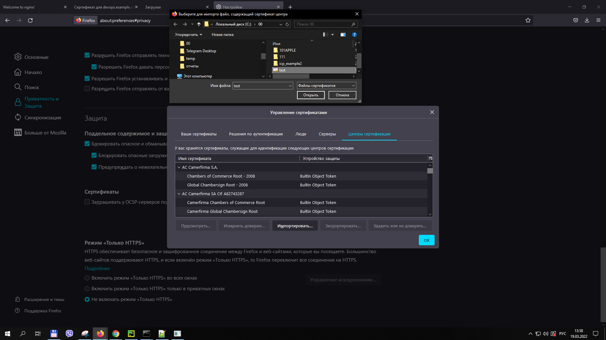
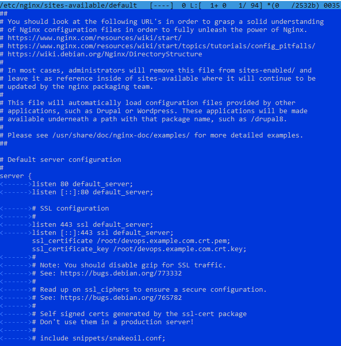
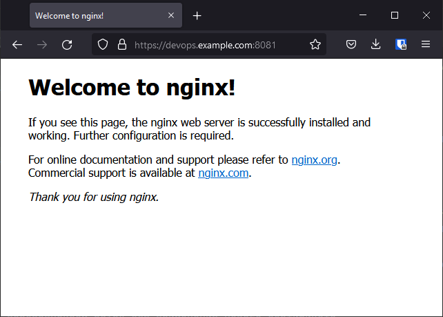
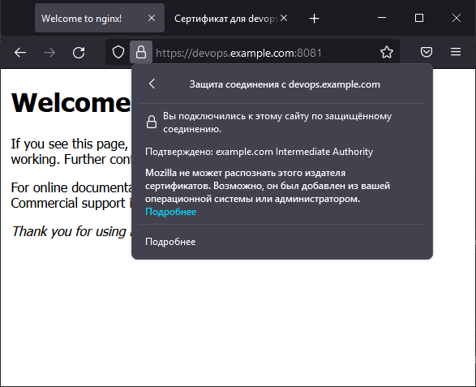
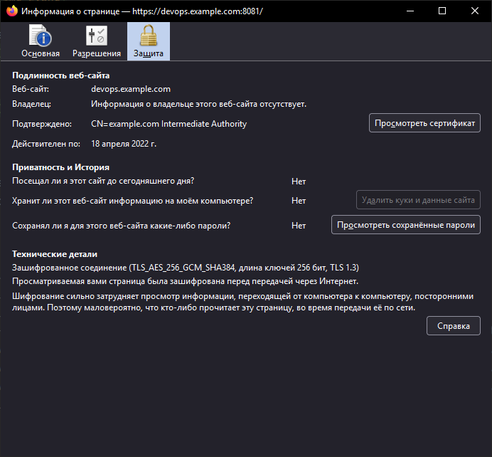
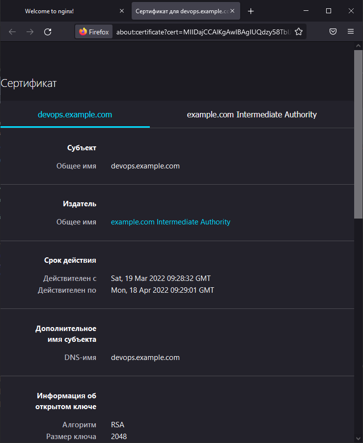

# Курсовая работа по итогам модуля "DevOps и системное администрирование"

Курсовая работа необходима для проверки практических навыков, полученных в ходе прохождения курса "DevOps и системное администрирование".

Мы создадим и настроим виртуальное рабочее место. Позже вы сможете использовать эту систему для выполнения домашних заданий по курсу

## Задание

1. Создайте виртуальную машину Linux.
```
Vagrantfile
Vagrant.configure(2) do |config|
   config.vm.box = "bento/ubuntu-20.04"
   config.vm.provision "shell", path: "provision.sh"
  config.vm.network "forwarded_port", guest: 80, host: 8080
  config.vm.network "forwarded_port", guest: 443, host: 8081
end

provision.sh
apt-get -y update
apt-get -y install nginx mc jq
service nginx start
sudo cp /vagrant/vault /bin/
echo 127.0.0.1 devops.example.com | sudo tee --append /etc/hosts
```

2. Установите ufw и разрешите к этой машине сессии на порты 22 и 443, при этом трафик на интерфейсе localhost (lo) должен ходить свободно на все порты.




3. Установите hashicorp vault ([инструкция по ссылке](https://learn.hashicorp.com/tutorials/vault/getting-started-install?in=vault/getting-started#install-vault)).
Закачка hashicorp vault через VPN 

```
в 1 терминале
vault server -dev -dev-root-token-id root
в другом терминале
export VAULT_ADDR=http://127.0.0.1:8200
export VAULT_TOKEN=root
vault status
```

4. Cоздайте центр сертификации по инструкции ([ссылка](https://learn.hashicorp.com/tutorials/vault/pki-engine?in=vault/secrets-management)) и выпустите сертификат для использования его в настройке веб-сервера nginx (срок жизни сертификата - месяц).


```
------------------Создание корневого сертификата example.com
vault secrets enable pki
vault secrets tune -max-lease-ttl=8760h pki
vault write -field=certificate pki/root/generate/internal common_name="example.com" ttl=87600h > CA_cert.crt
vault write pki/config/urls issuing_certificates="http://127.0.0.1:8200/v1/pki/ca" crl_distribution_points="http://127.0.0.1:8200/v1/pki/crl"
vault secrets enable -path=pki_int pki
vault secrets tune -max-lease-ttl=8760h pki_int
vault write -format=json pki_int/intermediate/generate/internal common_name="example.com Intermediate Authority" | jq -r '.data.csr' > pki_intermediate.csr
vault write -format=json pki/root/sign-intermediate csr=@pki_intermediate.csr format=pem_bundle ttl="8760h" | jq -r '.data.certificate' > intermediate.cert.pem
vault write pki_int/intermediate/set-signed certificate=@intermediate.cert.pem
vault write pki_int/roles/example-dot-com allowed_domains="example.com" allow_subdomains=true max_ttl="4380h"
vault list pki_int/roles/


------------------Создание сертификатов для devops.example.com
vault write -format=json pki_int/issue/example-dot-com common_name="devops.example.com" ttl=720h > devops.example.com.crt
cat devops.example.com.crt
cat devops.example.com.crt | jq -r .data.certificate > devops.example.com.crt.pem
cat devops.example.com.crt | jq -r .data.issuing_ca >> devops.example.com.crt.pem
cat devops.example.com.crt | jq -r .data.private_key > devops.example.com.crt.key


```

5. Установите корневой сертификат созданного центра сертификации в доверенные в хостовой системе.

```ln -s /root/CA_cert.crt /usr/local/share/ca-certificates/CA_cert.crt  
update-ca-certificates
Updating certificates in /etc/ssl/certs...
1 added, 0 removed; done.
Running hooks in /etc/ca-certificates/update.d...
done.
```


6. Установите nginx.
По инструкции ([ссылка](https://nginx.org/en/docs/http/configuring_https_servers.html)) настройте nginx на https, используя ранее подготовленный сертификат:
  - можно использовать стандартную стартовую страницу nginx для демонстрации работы сервера;
  - можно использовать и другой html файл, сделанный вами;
начальная установка на 1 шаге в файле provision.sh
конфигурация изменить на




8. Откройте в браузере на хосте https адрес страницы, которую обслуживает сервер nginx.







10. Создайте скрипт, который будет генерировать новый сертификат в vault:
  - генерируем новый сертификат так, чтобы не переписывать конфиг nginx;
  - перезапускаем nginx для применения нового сертификата.

```
#!/bin/bash
#file /root/updsert.sh
export VAULT_ADDR=http://127.0.0.1:8200
export VAULT_TOKEN=root
vault write -format=json pki_int/issue/example-dot-com common_name="devops.example.com" ttl=720h > /root/devops.example.com.crt
cat /root/devops.example.com.crt | jq -r .data.certificate > /root/devops.example.com.crt.pem
cat /root/devops.example.com.crt | jq -r .data.issuing_ca >> /root/devops.example.com.crt.pem
cat /root/devops.example.com.crt | jq -r .data.private_key > /root/devops.example.com.crt.key
systemctl reload nginx
```


10. Поместите скрипт в crontab, чтобы сертификат обновлялся какого-то числа каждого месяца в удобное для вас время.

```commandline
root@vagrant:~# crontab -l
29 12 19 * * /root/updsert.sh >>/tmp/2.log 2>&1


syslog 
Mar 19 12:29:01 vagrant CRON[28887]: (root) CMD (/root/updsert.sh >>/tmp/2.log 2>&1)
Mar 19 12:29:02 vagrant systemd[1]: Reloading A high performance web server and a reverse proxy server.
Mar 19 12:29:02 vagrant systemd[1]: Reloaded A high performance web server and a reverse proxy server.


```


## Результат

Результатом курсовой работы должны быть снимки экрана или текст:

- Процесс установки и настройки ufw
- Процесс установки и выпуска сертификата с помощью hashicorp vault
- Процесс установки и настройки сервера nginx
- Страница сервера nginx в браузере хоста не содержит предупреждений 
- Скрипт генерации нового сертификата работает (сертификат сервера ngnix должен быть "зеленым")
- Crontab работает (выберите число и время так, чтобы показать что crontab запускается и делает что надо)
